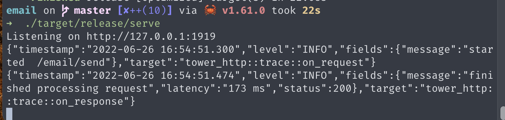

<div align="center">
<h1>email serve for Rust</h1>
邮件服务（仅支持 SMTP）
</div>

#### 依赖 [lettre](https://github.com/lettre/lettre)
#### 仅支持 发送（send）

#### 使用方式

1. 修改 `serve/src/main.rs` 内 或者 运行时设置环境变量运行：

  ```rs
  /// 默认账户
  const USER_NAME: &str = "xxxxx";
  const PASS_WORD: &str = "xxxxx";
  ```
2. 设置变量

  ```zsh
  PORT=xxxxxx;USER=xxxxx;PASS_WORD=xxxxx cargo run
  ```

3. 运行

  ```zsh
    ➜ cargo run # 开发预览
    ➜ cargo build --release # 打包
    ➜ ./target/debug/serve # 运行
    ➜ PORT=xxxxxx;USER=xxxxx;PASS_WORD=xxxxx ./target/debug/serve # 携带环境变量运行
  ```

  

#### 接口地址

- `/email/send`

#### TODO

- [ ] Docker 支持
- [ ] Imap 支持